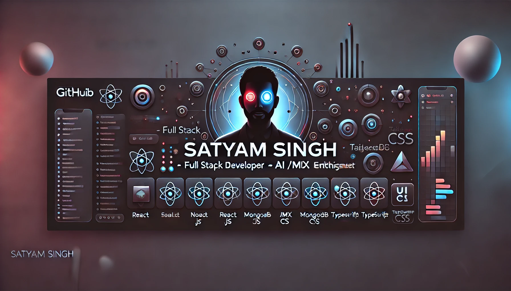

<!-- 👇 GitHub Profile Banner -->

  

<h1 align="center">Hey 👋, I'm Satyam Singh</h1>
<h3 align="center">Full Stack Developer ⚙️ | AI/ML Explorer 🤖 | UI/UX Craftsman 🎨</h3>

<!-- 🔥 Typing Animation Header -->

  

<!-- 👁 Visitor Count -->

  

---

### 📘 About Me

  
<strong>📖 Know More About Me</strong>

- 🎓 B.Tech in **Artificial Intelligence & Machine Learning** from **Galgotias College of Engineering & Technology**
- 🧠 Passionate about merging **Full Stack Development** with the power of **AI/ML**
- 🔨 Currently working on: **Live Coupon Distribution Web App with Abuse Prevention**
- 🎮 Exploring: **Three.js**, **React Fiber**, **Framer Motion**
- 🤝 Open to collaborations on **AI-integrated Full Stack Projects**
- 🗣 Fun Fact: I overcame **stammering** with consistency and dedication 💪

---

### ⚙️ Tech Stack & Tools

  

---

### 🚀 Featured Projects

  
<strong>📂 Tap to Explore</strong>

- 🍽 **[Food Delivery App (MERN)](https://github.com/satyam200singh/food-delivery)**  
  Admin Panel • Cart System • Secure Payment Integration

- 📰 **[News App (React + Bootstrap)](https://github.com/satyam200singh/news-app)**  
  Multi-category UI • API Integration • Mobile Responsive

- ☁ **[Weather App (Vanilla JS)](https://github.com/satyam200singh/weather-app)**  
  Real-time Weather Fetch • Clean Interface

- ✉ **[SMS Spam Detector (ML)](https://github.com/satyam200singh/spam-detector)**  
  Text Classification using ML • Deployed via Streamlit

- ⏱ **[Real-Time Tracker (Socket.io)](https://github.com/satyam200singh/realtime-tracker)**  
  Live User Tracking • Node.js + Socket.IO

---

### 🎯 Currently Exploring

  
<strong>🧠 My Learning Zone</strong>

- ✨ Advanced UI Animations with **Framer Motion** & **GSAP**
- 🧠 Deep Learning Frameworks like **PyTorch** and **TensorFlow**
- 🔐 Web Authentication Systems: **OAuth**, **JWT**, **Clerk**
- 💬 Natural Language Processing with **NLP & Transformers**

---

### 🌐 Let's Connect

  
  
  

---

> *"The best way to predict the future is to create it." — Alan Kay*

  

